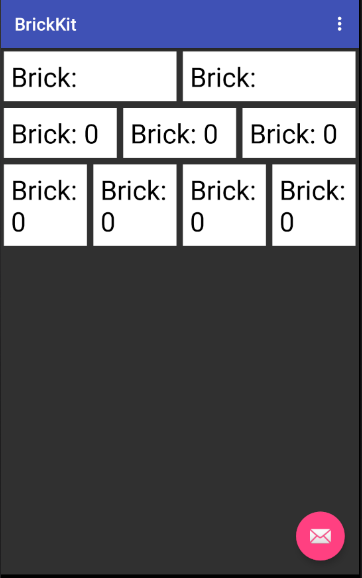

[](https://codecov.io/gh/wayfair/brickkit-android)
[  ](https://maven-badges.herokuapp.com/maven-central/com.wayfair/brickkit-android)

## What is BrickKit

With BrickKit, you can manage complex, dynamic, device type specific, and orientation aware layouts with the same code. It's easy to reuse and extend bricks which highly reduces code redundancy and makes UI testing easier. BrickKit is based on RecyclerView meaning it works well with many (think thousands) items inside. It allows you to take advantage of the performance built into RecyclerView without needing to maintain your own RecyclerView.Adapter, instead letting you focus on other things.


## How to import BrickKit as a library

The latest version is available on the Maven Central.
Add a MavenCentral to your repositories
```
 mavenCentral()
```
And add it as a Gradle implementation dependency [Latest](https://maven-badges.herokuapp.com/maven-central/com.wayfair/brickkit-android)
```
  implementation "com.wayfair:brickkit-android:1.0.1"
```

## Features of BrickKit

### Setting up BrickKit in your screen

Getting started with BrickKit is as simple as creating a BrickDataManager and setting the RecyclerView you want it to work on. After that you can start adding Bricks to it). 

```kotlin
open class BrickFragment : Fragment() {
    // Create your BrickDataManager
    private val dataManager = BrickDataManager()

    override fun onCreateView(inflater: LayoutInflater, container: ViewGroup?, savedInstanceState: Bundle?): View? {
        return inflater.inflate(R.layout.vertical_fragment_brick, container, false).apply {
            findViewById<RecyclerView>(R.id.recycler_view).apply {
                // Set the RecyclerView you want to use
                dataManager.setRecyeclerView(this)
            }
        }
    }
    
    override fun onResume() {
        super.onResume()

        // Have your feature build up your UI
        val bricks = (0 until 100).map { i -> TextBrick(HalfWidthBrickSize(), BrickPaddingFactory(resources), "Brick: $i") }.toList()
        
        // Update BrickDataManager with your Bricks
        dataManager.updateBricks(bricks)
    }

    override fun onDestroyView() {
        // Clean up references when your view is destroyed
        dataManager.onDestroyView()
        super.onDestroyView()
    }
}
```

## Manage your bricks with BrickDataManager

The 'BrickDataManager' manages the RecyclerView's adapter and manipulates the bricks. The preferred usage of BrickDataManager is with `updateBricks`, which is built off of DiffUtils and allows you to build your UI in one go (either when building your initial UI or when updating it when new elements should be added or removed).

| Methods Used Frequently | Description |
|----------|:-------------:|
| setRecyclerView | Sets the RecyclerView that BrickDataManager will operate on |
| setHorizontalRecyclerView | Same as setRecyclerView but for use with horizontally scrolling RecyclerViews |
| updateBricks | Will replace the current UI with the new set of bricks (built using DiffUtils) |
| addLast | Inserts brick/Collection of bricks after all other bricks. |
| addFirst | Inserts brick  before all other bricks. |
| isEmpty | Returns whether or not the BrickDataManager has had any items added |
| setOnReachedItemAtPosition | Sets a listener that will provide binding location updates (useful when implementing infinite scroll).


### Bricks with different spans and padding

Building layouts differently for different screen orientations and device type is easy and handled by BrickKit. Simply pass one of the in one of the various `BrickSize` subclasses into the brick you are creating. There are a number of `BrickSize` subclasses that provide either a consistent size between phone and tablets as well as others like `HalfPhoneQuarterTabletBrickSize` which will provide different sizes based on device type. Brickkit provides the ability to intelligently add padding to your items so you don't need to worry about where they end up on screen. Using `BrickPaddingFactory` you just need to pass in the dimen resources you want to apply and the reset will be taken care of for you.



```kotlin
    override fun onCreateView(savedInstanceState: Bundle?) {
        (0 until 2).forEach { i -> 
            TextBrick(
                HalfWidthBrickSize(), 
                brickPaddingFactory.getInnerOuterPadding(R.dimen.inner_padding, R.dimen.outer_padding), 
                "Brick: $i"
            ).addLastTo(dataManager) 
        }
        (0 until 3).forEach { i -> 
            TextBrick(
                ThirdWidthBrickSize(), 
                brickPaddingFactory.getInnerOuterPadding(R.dimen.inner_padding, R.dimen.outer_padding), 
                "Brick: $i"
            ).addLastTo(dataManager)
        }
        (0 until 4).forEach { i -> 
            TextBrick(
                QuarterWidthBrickSize(), 
                brickPaddingFactory.getInnerOuterPadding(R.dimen.inner_padding, R.dimen.outer_padding), 
                "Brick: $i"
            ).addLastTo(dataManager)
        }
    }
```

| BrickPaddingFactory Methods | Description |
|----------|:----------:|
| getSimpleBrickPadding | Applies the same padding to all sides of the brick |
| getInnerOuterBrickPadding | Applies outer padding to brick sides that touch the edges of the recycler view, inner padding to all inner sides. This is helpful when trying to avoid "double" padding between items |
| getRectBrickPadding | Applies different paddings to each side |
| getInnerOuterRectBrickPadding | Combines the concepts of `getInnerOuterBrickPadding` and `getRectBrickPadding` |
| getViewInsetPadding | Similar to getInnerOuterRectBrickPadding but with the outer padding set to 16dp |


## How to run BrickKit demo project

```
1. git clone 'git@github.com:wayfair/brickkit-android.git'
2. Open Android Studio -> New -> Import Project (with the BrickKit folder not the base)
3. Run BrickKit
```

## Credits

BrickKit is owned and maintained by [Wayfair](https://www.wayfair.com).

## Contributing

See [CONTRIBUTING.md](CONTRIBUTING.md).


## License

BrickKit is released under the Apache license. See [LICENSE](LICENSE) for details.
