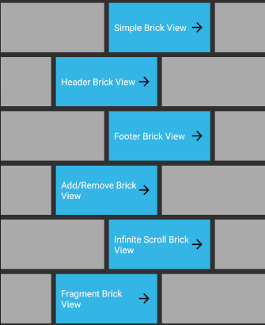
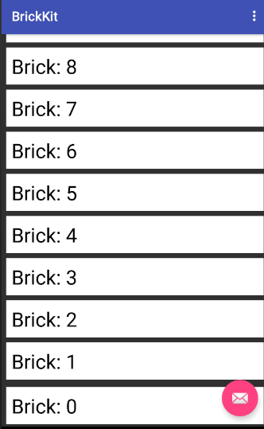
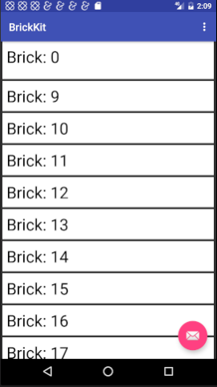
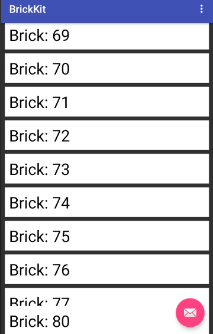
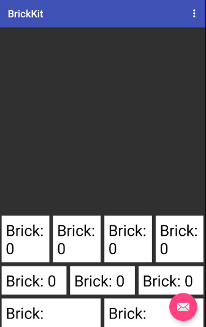

[](https://travis-ci.org/wayfair/brickkit-android)
[](http://codecov.io/github/wayfair/brickkit-android)

<div align="center">
<span></span>
<span style="font-size:60px; writing-mode: tb-rl;">BrickKit</span>
</div>


## What is the BrickKit

With BrickKit, you can manage complex, dynamic, device type specific, and orientation aware layouts with the same code. It's easy to reuse and extend bricks which highly reduces code redundancy and makes UI testing easier. BrickKit is based on RecyclerView and GridLayoutManager meaning it works well with many (think thousands) items inside. Use it, extend it, and make it your own!


## How to import BrickKit as a library

Add new maven endpoint to your repositories

```
  maven {
    url  "http://wayfair.bintray.com/brickkit-android"
  }
```
And add it as a Gradle compine dependency
```
  compile "com.wayfair:brickkit-android:0.9.1"
```

## How to run BrickKit demo project

```
1. git clone 'git@github.com:wayfair/brickkit-android.git'
2. Open Android Studio -> New -> Import Project
3. Run BrickKit
```

## Features of BrickKit

### BasicFragment

We created `BrickFragment` as a convienence to you and ourselves. Our [Android Application](https://play.google.com/store/apps/details?id=com.wayfair.wayfair "Google Play Store: Wayfair - Furniture & Decor") is primarily based off of this class (50+ fragments extend) and it has greatly reduced the lines of code and complexity of those Fragments.


```java
public class SimpleBrickFragment extends BrickFragment {
      private static final int HALF = 120;  //maxSpans == 240; We use 240
                                            //because of how many numbers it
                                            //can be divided by easily.
      private int numberOfBricks = 20;

      public static SimpleBrickFragment newInstance(int numberOfBricks) {
          SimpleBrickFragment fragment = new SimpleBrickFragment();
          fragment.numberOfBricks = numberOfBricks;
          return fragment;
      }

      @Override
      public void onCreate(Bundle savedInstanceState) {
          super.onCreate(savedInstanceState);

          for (int i = 0; i < numberOfBricks; i++) {
              TextBrick textBrick = new TextBrick(
                      getContext(),
                      new OrientationBrickSize(maxSpans()) {
                          @Override
                          protected int portrait() {
                              return dataManager.getMaxSpanCount();
                          }

                          @Override
                          protected int landscape() {
                              return HALF;
                          }
                      },
                      new InnerOuterBrickPadding() {
                          @Override
                          protected int innerPadding() {
                              return 5;
                          }

                          @Override
                          protected int outerPadding() {
                              return 10;
                          }
                      },
                      "Brick: " + i
              );
              dataManager.addLast(textBrick);
          }
    }

    public void addBehaviors() { }

    public int orientation() {
        return OrientationHelper.VERTICAL;
    }

    public boolean reverse() {
        return false;
    }
}

```

| Method   |      Description  |
|----------|:-------------:|
| onCreate | Generally where you will create bricks for display in the recycler view. When created here, they will be immediately ready for the view when it is displayed. Bricks can be created and added at anytime if you wan them to animate in. |
| onCreateView | Generally where you will add Behaviours (think sticky header and footer) and other features like Swipe-To-Dismiss and Drag-And-Drop. |
| orientation | Defines the orientations in which the 'bricks' are layed out (GridLayoutManager.VERTICAL/GridLayoutManager.HORIZONTAL) |
| reverse | If false, the bricks will be added from the top of screen, otherwise it will be added from the bottom. |


### Bricks with different spans

Building layouts differently for different screen orientations and device type is easy and handled by BrickKit. Simply define different span values in various `BrickSize` subclasses and pass them into the brick you are creating. It is the easiest way to create dynamic layouts across your App.


```java
@Override
public void onCreate(Bundle savedInstanceState) {
    for (int i = 0; i < dataManager.getMaxSpanCount() / HALF; i++) {   // HALF == 120
        TextBrick textBrick = new TextBrick(
                getContext(),
                new OrientationBrickSize(maxSpans()) {
                    @Override
                    protected int portrait() {
                        return HALF;
                    }

                    @Override
                    protected int landscape() {
                        return HALF;
                    }
                },
                new InnerOuterBrickPadding() {
                    @Override
                    protected int innerPadding() {
                        return 5;
                    }

                    @Override
                    protected int outerPadding() {
                        return 10;
                    }
                },
                "Brick: " + i
        );
        dataManager.addLast(textBrick);
    }

    for (int i = 0; i < dataManager.getMaxSpanCount() / ONE_THIRD; i++) { //ONE_THIRD == 80
        TextBrick textBrick = new TextBrick(
                getContext(),
                new OrientationBrickSize(maxSpans()) {
                    @Override
                    protected int portrait() {
                        return ONE_THIRD;
                    }

                    @Override
                    protected int landscape() {
                        return HALF;
                    }
                },
                new InnerOuterBrickPadding() {
                    @Override
                    protected int innerPadding() {
                        return 5;
                    }

                    @Override
                    protected int outerPadding() {
                        return 10;
                    }
                },
                "Brick: " + i
        );
        dataManager.addLast(textBrick);
    }

    for (int i = 0; i < dataManager.getMaxSpanCount() / QUARTER; i++) { //QUARTER == 60
        TextBrick textBrick = new TextBrick(
                getContext(),
                new OrientationBrickSize(maxSpans()) {
                    @Override
                    protected int portrait() {
                        return QUARTER;
                    }

                    @Override
                    protected int landscape() {
                        return HALF;
                    }
                },
                new InnerOuterBrickPadding() {
                    @Override
                    protected int innerPadding() {
                        return 5;
                    }

                    @Override
                    protected int outerPadding() {
                        return 10;
                    }
                },
                "Brick: " + i
        );
        dataManager.addLast(textBrick);
    }
}
```

### Bricks with different behaviors

#### StickyHeader layout


```java
@Override
public View onCreateView(LayoutInflater inflater, ViewGroup container, Bundle savedInstanceState) {
    View view = super.onCreateView(inflater, container, savedInstanceState);
    dataManager.addBehavior(new StickyHeaderBehavior(dataManager));
    return view;
}

@Override
public void onCreate(Bundle savedInstanceState) {
    BaseBrick brick = new TextBrick(
            getContext(),
            new SimpleBrickSize(maxSpans()) {
                @Override
                protected int size() {
                    return dataManager.getMaxSpanCount();
                }
            },
            "simple" + i
    );
    brick.setHeader(true);
    dataManager.addLast(brick);
}
```

#### StickyFooter layout


```java
@Override
public View onCreateView(LayoutInflater inflater, ViewGroup container, Bundle savedInstanceState) {
    View view = super.onCreateView(inflater, container, savedInstanceState);
    dataManager.addBehavior(new StickyFooterBehavior(dataManager));
    return view;
}

@Override
public void onCreate(Bundle savedInstanceState) {
    BaseBrick brick = new TextBrick(
            getContext(),
            new SimpleBrickSize(maxSpans()) {
                @Override
                protected int size() {
                    return MAX_SPANS;
                }
            },
            "simple" + i
    );
    brick.setFooter(true);
    dataManager.addLast(brick);
}
```

#### Reverse layout

```java
@Override
public boolean reverse() {
    return true;
}
```

#### Section layout
```java
public class FragmentBrickFragment extends BrickFragment {
    @Override
    public void createBricks() {
        for (int i = 0; i < 2; i++) {
            BaseBrick brick = new FragmentBrick(
                    getContext(),
                    new SimpleBrickSize(maxSpans()) {
                        @Override
                        protected int size() {
                            return dataManager.getMaxSpanCount() / 2;
                        }
                    },
                    getChildFragmentManager(),
                    SimpleBrickFragment.newInstance(50 * (i + 1)),
                    "simple" + i
            );
            dataManager.addLast(brick);
        }
    }
}
```
> FragmentBrick enables us to nest the brickFragment within the another one in which we could brick the simple bricks in the nested brickFragment and arrange the outer brickFragment as well. This gives us the idea of `sections`.
> **USE THIS WITH CARE: It prevents recycling of these bricks**


## Customize your own brick
```java
public class MyBrick extends BaseBrick {
  /**
   * Constructor.
   *
   * @param context context this brick exists in
   * @param spanSize size information for this brick
   * @param padding padding for this brick
   */
    public MyBrick(Context context, BrickSize spanSize, BrickPadding padding) {
        super(context, spanSize, padding);
    }

    /**
     * Called by the BrickRecyclerAdapter to display the information in this brick to the specified ViewHolder.
     *
     * @param viewHolder ViewHolder which should be updated.
     */    
    @Override
    public void onBindData(RecyclerView.ViewHolder viewHolder) {
        MyBrickHolder myBrickHolder = (MyBrickHolder) viewHolder;
        myBrickHolder.myTextView.setText(text);
    }

    /**
     * Get layout resource id for this brick.
     *
     * @return the layout resource id for this brick
     */
    @Override
    public int getLayout() {
        return R.layout.my_brick;
    }

    /**
     * Creates an instance of the {@link BrickViewHolder} for this class.
     *
     * @param itemView view to pass into the {@link BrickViewHolder}
     * @return the {@link BrickViewHolder}
     */
    @Override
    public BrickViewHolder createViewHolder(View itemView) {
        return new MyBrickHolder(itemView);
    }

    /**
     * {@link BrickViewHolder} for MyBrickHolder.
     */
    static class MyBrickHolder extends BrickViewHolder {
        TextView myTextView;

        /**
         * Constructor for MyBrickHolder.
         *
         * @param itemView view for this brick
         */
        MyBrickHolder(View itemView) {
            super(itemView);

            myTextView = (TextView) itemView.findViewById(R.id.my_text_view);
        }
    }
}
```

>- `getLayout()` should be the id of the XML you wish to inflate for the brick.
>- Pass in or hard-code the padding you want this brick instance to have.


## Manager your bricks with BrickDataManager

The 'BrickDataManager' manages the RecyclerView's adapter and manipulates the bricks. You could add/remove 'bricks' at different positions, get/replace 'bricks' at certain positions.

| Methods Used Frequently   |      Description  |
|----------|:-------------:|
| getRecyclerViewItems |  Gets all 'visible' bricks in the 'BaseDataManager'.
| getDataManagerItems |  Gets all bricks in the 'BaseDataManager'.
| addLast |  Inserts brick/Collection of bricks after all other bricks.
| addFirst |   Inserts brick/Collection of bricks before all other bricks.
| addBefore | Inserts a brick/collection of bricks before the given anchor brick.
| addAfter | Inserts a brick/collection of bricks after the given anchor brick.
| removeItem(s) |  Remove a brick/collection of bricks.
| removeAll | Removes all bricks of a certain class.
| refreshItem | Refreshes the content of that brick.
| hideItem | Makes the brick invisible to the RecyclerView, but keeps it in the `DataManager`.
| showItem | Makes the brick visible to the RecyclerView.
| moveItem | Relocates the brick from one position to another.
| replaceItem | Swaps the target brick for the new one you are passing in.
| clear | Removes all bricks.
| setItems | Completely removes all existing bricks and inserts the collection of bricks you pass in.
| brickWithLayout |  Retrieves a brick who's associated layout resource ID matches.
| brickAtPosition |  Retrieves a brick at a specific position.

## Credits

BrickKit is owned and maintained by [Wayfair](https://www.wayfair.com).

## Contributing

See [CONTRIBUTING.md](CONTRIBUTING.md).


## License

BrickKit is released under the Apache license. See LICENSE for details.
